# IaC Confluent Cloud AWS Egress Private Linking, Infrastructure and Networking Example
This Terraform workspace provisions **Confluent Cloud Egress PrivateLink** infrastructure that enables Enterprise Kafka cluster connectors to reach external AWS services over private networking — without traversing the public internet.

It provisions two egress patterns side by side, sharing a single egress gateway:

- **S3 Sink Connector** — native AWS PrivateLink service, fully automated
- **JDBC Source/Sink Connector** — self-managed database behind a Network Load Balancer, requires one manual AWS acceptance step

It is a downstream workspace that depends on the environment ID output from the [iac-cc-aws-ingress-privatelink-infrastructure-networking-example](https://github.com/j3-signalroom/iac-cc-aws_ingress_privatelink-infrastructure_networking-example).

---

**Table of Contents**
<!-- toc -->
+ [1.0 Overview](#10-overview)
+ [2.0 Why JDBC Egress Is Structurally Different from S3](#20-why-jdbc-egress-is-structurally-different-from-s3)
    + [2.1 S3: Native AWS PrivateLink Service](#21-s3-native-aws-privatelink-service)
    + [2.2 JDBC: Self-Managed Service Behind a Network Load Balancer](#22-jdbc-self-managed-service-behind-a-network-load-balancer)
    + [2.3 Side-by-Side Comparison](#23-side-by-side-comparison)
+ [3.0 Architecture](#30-architecture)
    + [3.1 S3 flow](#31-s3-flow)
    + [3.2 JDBC flow](#32-jdbc-flow)
+ [4.0 Prerequisites](#40-prerequisites)
+ [5.0 Workspace Dependencies](#50-workspace-dependencies)
+ [6.0 Resources Provisioned](#60-resources-provisioned)
    + [6.1 Shared](#61-shared)
    + [6.2 S3 Egress](#62-s3-egress)
    + [6.3 JDBC Egress](#63-jdbc-egress)
+ [7.0 Let's Get Started](#70-lets-get-started)
    + [7.1 Deploy the Infrastructure](#71-deploy-the-infrastructure)
    + [7.2 Teardown the Infrastructure](#72-teardown-the-infrastructure)
+ [8.0 Outputs](#80-outputs)
    + [8.1 Gateway](#81-gateway)
    + [8.2 S3](#82-s3)
    + [8.3 JDBC](#83-jdbc)
+ [9.0 Post-Apply: Manual AWS Acceptance Step (JDBC only)](#90-post-apply-manual-aws-acceptance-step-jdbc-only)
+ [10.0 Post-Apply: S3 Bucket Policy](#100-post-apply-s3-bucket-policy)
+ [11.0 Connector Configuration](#110-connector-configuration)
    + [11.1 S3 Sink Connector](#111-s3-sink-connector)
    + [11.2 JDBC Source / Sink Connector](#112-jdbc-source--sink-connector)
+ [12.0 Adding More Egress Endpoints](#120-adding-more-egress-endpoints)
+ [13.0 Troubleshooting](#130-troubleshooting)
+ [14.0 Resources](#140-resources)
<!-- tocstop -->

---

## **1.0 Overview**

AWS PrivateLink supports two directions of connectivity in Confluent Cloud:

| Direction | Gateway Type | Purpose |
|---|---|---|
| **Ingress** | `aws_ingress_private_link_gateway` | Your VPC → Confluent Cloud Kafka clusters |
| **Egress** | `aws_egress_private_link_gateway` | Confluent Cloud connectors → Your AWS services |

This workspace manages the **egress** direction. One egress gateway is allowed per AWS region per Confluent Cloud environment, and it is shared across all Enterprise clusters in that environment, and across both the S3 and JDBC access points provisioned here.

---

## **2.0 Why JDBC Egress Is Structurally Different from S3**

This is the central architectural distinction in this workspace and the reason the JDBC pattern requires significantly more AWS infrastructure.

### **2.1 S3: Native AWS PrivateLink Service**

S3 is a first-party AWS service with a pre-existing, AWS-managed PrivateLink endpoint service in every region (`com.amazonaws.<region>.s3`). Because AWS already owns and operates that endpoint service, Confluent can connect to it directly, there is no Network Load Balancer (NLB) to create, no endpoint service to configure, and no access acceptance step. AWS manages the allowlist implicitly.

Confluent resolves the standard S3 hostname (`s3.<region>.amazonaws.com`) to the VPC endpoint transparently via the `confluent_dns_record`. The S3 connector does not need to know it is communicating over PrivateLink.

The entire S3 egress path is **fully automated by Terraform** and transitions to `Ready` without any manual steps.

### **2.2 JDBC: Self-Managed Service Behind a Network Load Balancer**

A database, whether RDS, EC2-hosted, or on-premises, is not a native AWS PrivateLink service. AWS PrivateLink can only front services that are exposed through a **Network Load Balancer**. This means before Confluent can create a VPC endpoint to your database, you must first build the AWS-side PrivateLink infrastructure yourself:

| Layer | Resource | Why it's needed |
|---|---|---|
| Target registration | `aws_lb_target_group` + `aws_lb_target_group_attachment` | Registers the database's private IP with a specific port |
| Traffic control | `aws_security_group` + rules | Restricts NLB access to the database port and VPC CIDR |
| Load balancer | `aws_lb` (internal, Network) | AWS PrivateLink requires an internal NLB as the backing service |
| PrivateLink exposure | `aws_vpc_endpoint_service` | Wraps the NLB as a PrivateLink-addressable endpoint service |

Only after this AWS infrastructure exists can Confluent create a VPC endpoint against it via `confluent_access_point`.

> _There is also a **step that Terraform cannot automate**: even though this workspace pre-authorizes Confluent's IAM principal in `aws_vpc_endpoint_service.allowed_principals`, AWS still requires explicit operator acceptance of each new endpoint connection request. This is an AWS-enforced safety gate (`acceptance_required = true`) that exists regardless of the allowlist, it prevents accidental or unauthorized endpoint connections. The `confluent_access_point` will remain in `Pending accept` until an operator accepts it in the AWS console._

### **2.3 Side-by-Side Comparison**

| Dimension | S3 Egress | JDBC Egress |
|---|---|---|
| **Endpoint service owner** | AWS | You |
| **AWS resources required** | None | Target group, NLB, security group, endpoint service |
| **Service name source** | Interpolated: `com.amazonaws.${region}.s3` | Dynamic: `aws_vpc_endpoint_service.jdbc.service_name` |
| **IAM principal allowlist** | Not applicable — AWS manages | Automated via `allowed_principals` in Terraform |
| **Manual acceptance step** | None — transitions directly to `Ready` | Required — operator must accept in AWS console |
| **HA recommended** | No — S3 is regionally redundant | Yes — `enable_high_availability = true` to deploy NICs across AZs |
| **DNS domain** | AWS standard: `s3.<region>.amazonaws.com` | Your database FQDN: must exactly match connector `connection.url` |
| **NLB cross-zone required** | No | Yes — prevents AZ-mismatch failures between Confluent's endpoint NICs and NLB subnets |
| **Connector config impact** | Transparent — connector uses standard S3 endpoint | Explicit — connector `connection.url` hostname must match `database_domain` |

---

## **3.0 Architecture**

```mermaid
flowchart TB

    subgraph TFC["Terraform Cloud — signalroom"]
        direction TB
        WS1["Workspace: iac-cc-aws-ingress-privatelink-infrastructure-networking-example\n(Ingress — upstream)"]
        WS2["Workspace: iac-cc-aws-egress-privatelink-infrastructure-networking-example\n(Egress — this workspace)"]
        WS1 -- "output: non_prod_environment_id\n→ var: confluent_environment_id" --> WS2
    end

    subgraph CCLOUD["Confluent Cloud — non-prod Environment"]
        direction TB

        subgraph SHARED["Shared Gateway"]
            EGW["confluent_gateway.non_prod_egress\naws_egress_private_link_gateway\n─────────────────\nExposes: principal_arn\n(IAM role Confluent uses\nto create VPC endpoints)"]
            SLEEP["time_sleep\n2 min provisioning wait"]
            EGW --> SLEEP
        end

        subgraph S3PATH["S3 Egress Path — Fully Automated"]
            S3AP["confluent_access_point.egress_s3\nService: com.amazonaws.REGION.s3\nHA: false"]
            S3DNS["confluent_dns_record.egress_s3\nDomain: s3.REGION.amazonaws.com"]
            S3AP --> S3DNS
        end

        subgraph JDBCPATH["JDBC Egress Path — Requires Manual Acceptance"]
            JDBCAP["confluent_access_point.egress_jdbc\nService: aws_vpc_endpoint_service.jdbc\nHA: true  ← multi-AZ NICs"]
            JDBCDNS["confluent_dns_record.egress_jdbc\nDomain: var.database_domain\n(must match connector connection.url)"]
            JDBCAP --> JDBCDNS
        end

        SLEEP --> S3AP
        SLEEP --> JDBCAP
    end

    subgraph AWS["AWS — Database VPC"]
        direction TB

        subgraph JDBC_INFRA["JDBC AWS Infrastructure (owned by you)"]
            direction TB
            TG["aws_lb_target_group.jdbc\nProtocol: TCP\nTarget type: ip\nPort: database_port"]
            TGA["aws_lb_target_group_attachment.jdbc\nTarget: database_private_ip"]
            SG["aws_security_group.nlb_jdbc\nIngress: database_port from VPC CIDR\nEgress: all"]
            NLB["aws_lb.jdbc\nInternal Network Load Balancer\ncross_zone: enabled\nPrivateLink inbound rule enforcement: off"]
            LIS["aws_lb_listener.jdbc\nTCP:database_port → target group"]
            EPCSVC["aws_vpc_endpoint_service.jdbc\nacceptance_required: true\nallowed_principals: egress_gateway_iam_principal\n─────────────────────────────\n⚠ Manual step required:\nAWS Console → Endpoint connections\n→ Accept pending connection"]

            TG --> TGA
            SG --> NLB
            TG --> NLB
            NLB --> LIS
            LIS --> EPCSVC
        end

        subgraph DB["Database"]
            DATABASE["RDS / EC2 / On-premises\ndatabase_private_ip:database_port"]
        end

        TGA --> DATABASE
    end

    subgraph S3SVC["AWS — S3 (AWS-managed PrivateLink service)"]
        S3EP["com.amazonaws.REGION.s3\nAWS-owned endpoint service\n(no NLB, no acceptance step)"]
        S3BUCKET["Amazon S3 Bucket\n─────────────────\nBucket Policy:\n• Principal: egress_gateway_iam_principal\n• Condition: aws:sourceVpce: egress_s3_vpc_endpoint_id"]
        S3EP --> S3BUCKET
    end

    subgraph OUTPUTS["Terraform Outputs"]
        OG1["egress_gateway_id"]
        OG2["egress_gateway_iam_principal\n→ S3 bucket policy Principal\n→ JDBC allowed_principals (automated)"]
        OS1["egress_s3_access_point_id"]
        OS2["egress_s3_vpc_endpoint_id\n→ S3 bucket policy aws:sourceVpce"]
        OJ1["egress_jdbc_access_point_id"]
        OJ2["egress_jdbc_vpc_endpoint_id"]
        OJ3["nlb_arn / nlb_dns_name"]
        OJ4["jdbc_connector_connection_url_hint\n→ connector connection.url"]
    end

    %% Confluent creates VPC endpoints via its IAM principal
    S3AP -- "Confluent creates Interface\nVPC Endpoint (automated)" --> S3EP
    JDBCAP -- "Confluent creates Interface\nVPC Endpoint (pending accept)" --> EPCSVC

    %% Output wiring
    EGW --> OG1
    EGW --> OG2
    S3AP --> OS1
    S3AP --> OS2
    JDBCAP --> OJ1
    JDBCAP --> OJ2
    NLB --> OJ3
    JDBCDNS --> OJ4

    style TFC fill:#f5f0ff,stroke:#7c3aed,color:#1a1a1a
    style CCLOUD fill:#e8f4fd,stroke:#0066cc,color:#1a1a1a
    style AWS fill:#fff3e0,stroke:#e65100,color:#1a1a1a
    style S3SVC fill:#fef9e7,stroke:#b7950b,color:#1a1a1a
    style OUTPUTS fill:#e8f5e9,stroke:#2e7d32,color:#1a1a1a
    style SHARED fill:#dbeafe,stroke:#1d4ed8,color:#1a1a1a
    style S3PATH fill:#dcfce7,stroke:#15803d,color:#1a1a1a
    style JDBCPATH fill:#fce7f3,stroke:#9d174d,color:#1a1a1a
    style JDBC_INFRA fill:#fff7ed,stroke:#c2410c,color:#1a1a1a
    style DB fill:#fef3c7,stroke:#b45309,color:#1a1a1a
```



### **3.1 S3 flow**

```
Confluent Cloud (Enterprise Cluster)
  └── Egress Gateway
        └── Access Point → com.amazonaws.<region>.s3  (AWS-managed)
              └── confluent_dns_record: s3.<region>.amazonaws.com
                    └── Amazon S3 Bucket
                          └── Bucket Policy: restrict to egress_s3_vpc_endpoint_id
```

### **3.2 JDBC flow**

```
Confluent Cloud (Enterprise Cluster)
  └── Egress Gateway
        └── Access Point → aws_vpc_endpoint_service (you own this)
              └── confluent_dns_record: <database_domain>
                    └── NLB Listener (TCP:<database_port>)
                          └── Target Group → Database Private IP
                                └── Database (RDS / EC2 / on-premises)
```

---

## **4.0 Prerequisites**

- An existing Confluent Cloud environment with at least one Enterprise Kafka cluster (provisioned by the ingress workspace)
- A database instance (RDS, EC2-hosted, or on-premises) with a known private IP and stable port
- The database VPC must have at least two private subnets spanning different AZs for NLB deployment
- AWS CLI with SSO configured (`aws2-wrap` required for `deploy.sh`)
- `graphviz` (`dot`) installed locally if you want the Terraform visualization generated by `deploy.sh`
- Terraform >= 1.5.0

---

## **5.0 Workspace Dependencies**

This workspace consumes one output from the ingress workspace:

| Output (ingress workspace) | Variable (this workspace) | Description |
|---|---|---|
| `non_prod_environment_id` | `confluent_environment_id` | Confluent Cloud environment ID |

Set `confluent_environment_id` as a Terraform variable in TFC before the first apply.

---

## **6.0 Resources Provisioned**

### **6.1 Shared**

| Resource | Type | Description |
|---|---|---|
| `confluent_gateway.non_prod_egress` | `confluent_gateway` | Egress PrivateLink gateway — shared by S3 and JDBC access points |
| `time_sleep.wait_for_egress_gateway` | `time_sleep` | 2-minute delay for Confluent control plane to fully provision the gateway |

### **6.2 S3 Egress**

| Resource | Type | Description |
|---|---|---|
| `confluent_access_point.egress_s3` | `confluent_access_point` | Interface VPC Endpoint targeting `com.amazonaws.<region>.s3` |
| `confluent_dns_record.egress_s3` | `confluent_dns_record` | Maps `s3.<region>.amazonaws.com` to the S3 VPC endpoint |

### **6.3 JDBC Egress**

| Resource | Type | Description |
|---|---|---|
| `aws_lb_target_group.jdbc` | `aws_lb_target_group` | IP-type target group for the database private IP and port |
| `aws_lb_target_group_attachment.jdbc` | `aws_lb_target_group_attachment` | Registers the database private IP in the target group |
| `aws_security_group.nlb_jdbc` | `aws_security_group` | Security group restricting NLB traffic to the database port and VPC CIDR |
| `aws_lb.jdbc` | `aws_lb` | Internal NLB fronting the database; cross-zone LB enabled, PrivateLink inbound rule enforcement disabled |
| `aws_lb_listener.jdbc` | `aws_lb_listener` | TCP listener on `database_port`, forwarding to the target group |
| `aws_vpc_endpoint_service.jdbc` | `aws_vpc_endpoint_service` | Exposes the NLB as a PrivateLink endpoint service; pre-authorizes Confluent's IAM principal |
| `confluent_access_point.egress_jdbc` | `confluent_access_point` | Interface VPC Endpoint targeting the JDBC endpoint service; HA enabled |
| `confluent_dns_record.egress_jdbc` | `confluent_dns_record` | Maps `database_domain` to the JDBC VPC endpoint |

---

## **7.0 Let's Get Started**

### **7.1 Deploy the Infrastructure**

The `deploy.sh` script handles authentication and Terraform execution: 

```bash
./deploy.sh create --profile=<SSO_PROFILE_NAME> \
                   --confluent-api-key=<CONFLUENT_API_KEY> \
                   --confluent-api-secret=<CONFLUENT_API_SECRET> \
                   --confluent-environment-id=<CONFLUENT_ENVIRONMENT_ID> \
                   --database-vpc-id=<DATABASE_VPC_ID> \
                   --database-subnet-ids=<SUBNET_ID_1,SUBNET_ID_2,SUBNET_ID_3> \
                   --database-private-ip=<DATABASE_PRIVATE_IP> \
                   --database-port=<DATABASE_PORT> \
                   --database-domain=<DATABASE_FQDN>
```
Here's the argument table for `deploy.sh create` command:

| Argument | Required | Description |
|----------|----------|-------------|
| `--profile` | ✅ | AWS CLI profile name with SSO credentials configured |
| `--confluent-api-key` | ✅ | Confluent Cloud API key |
| `--confluent-api-secret` | ✅ | Confluent Cloud API secret |
| `--confluent-environment-id` | ✅ | Confluent Cloud environment ID |
| `--database-vpc-id` | ✅ | AWS VPC ID where the database resides |
| `--database-subnet-ids` | ✅ | Comma-separated list of subnet IDs for the database |
| `--database-private-ip` | ✅ | Private IP address of the database |
| `--database-port` | ✅ | Port on which the database is listening |
| `--database-domain` | ✅ | Fully qualified domain name of the database |

> All 9 arguments are required — the script exits with code `85` if any are missing.

> **Note:** `database_subnet_ids` must be a comma-separated string with no spaces: `subnet-aaa,subnet-bbb,subnet-ccc`. The script passes this value unquoted so Terraform receives it correctly as a list.

### **7.2 Teardown the Infrastructure**

When you're done, use the same script to destroy all provisioned resources:

```bash
./deploy.sh destroy --profile=<SSO_PROFILE_NAME> \
                    --confluent-api-key=<CONFLUENT_API_KEY> \
                    --confluent-api-secret=<CONFLUENT_API_SECRET> \
                    --confluent-environment-id=<CONFLUENT_ENVIRONMENT_ID> \
                    --database-vpc-id=<DATABASE_VPC_ID> \
                    --database-subnet-ids=<SUBNET_ID_1,SUBNET_ID_2,SUBNET_ID_3> \
                    --database-private-ip=<DATABASE_PRIVATE_IP> \
                    --database-port=<DATABASE_PORT> \
                    --database-domain=<DATABASE_FQDN>
```
Here's the argument table for `deploy.sh destroy` command:

| Argument | Required | Description |
|----------|----------|-------------|
| `--profile` | ✅ | AWS CLI profile name with SSO credentials configured |
| `--confluent-api-key` | ✅ | Confluent Cloud API key |
| `--confluent-api-secret` | ✅ | Confluent Cloud API secret |
| `--confluent-environment-id` | ✅ | Confluent Cloud environment ID |
| `--database-vpc-id` | ✅ | AWS VPC ID where the database resides |
| `--database-subnet-ids` | ✅ | Comma-separated list of subnet IDs for the database |
| `--database-private-ip` | ✅ | Private IP address of the database |
| `--database-port` | ✅ | Port on which the database is listening |
| `--database-domain` | ✅ | Fully qualified domain name of the database |

> All 9 arguments are required — the script exits with code `85` if any are missing.

> **Note:** `database_subnet_ids` must be a comma-separated string with no spaces: `subnet-aaa,subnet-bbb,subnet-ccc`. The script passes this value unquoted so Terraform receives it correctly as a list.

---

## **8.0 Outputs**
The following outputs are available after `./deploy.sh create` completes. They are categorized by relevance to the shared gateway, S3 egress path, and JDBC egress path.

### **8.1 Gateway**

| Output | Description |
|---|---|
| `egress_gateway_id` | Confluent egress gateway ID — shared by S3 and JDBC |
| `egress_gateway_iam_principal` | IAM Principal ARN Confluent uses to create VPC endpoints; automatically set in `allowed_principals` for JDBC |

### **8.2 S3**

| Output | Description | Used For |
|---|---|---|
| `egress_s3_access_point_id` | Confluent access point ID for S3 | Reference in downstream configs |
| `egress_s3_vpc_endpoint_id` | AWS VPC endpoint ID for S3 | **S3 bucket policy `aws:sourceVpce` condition** |
| `s3_connector_endpoint_hint` | Standard S3 endpoint hostname | Connector configuration reference |

### **8.3 JDBC**

| Output | Description | Used For |
|---|---|---|
| `egress_jdbc_access_point_id` | Confluent access point ID for JDBC | Reference in downstream configs |
| `egress_jdbc_vpc_endpoint_id` | AWS VPC endpoint ID for JDBC | Database / NLB security group ingress rules |
| `nlb_arn` | NLB ARN | Troubleshooting, downstream reference |
| `nlb_dns_name` | NLB DNS name | Connectivity troubleshooting |
| `vpc_endpoint_service_name` | AWS PrivateLink service name | Visible in AWS console; reference only |
| `vpc_endpoint_service_id` | AWS Endpoint Service ID | Reference only |
| `jdbc_connector_connection_url_hint` | JDBC `connection.url` template | **Connector configuration** |

---

## **9.0 Post-Apply: Manual AWS Acceptance Step (JDBC only)**

> **This step is required before the JDBC connector will work.** The S3 access point does not require this.

After `terraform apply` completes, the JDBC `confluent_access_point` will be in `Pending accept` state. AWS holds every new endpoint connection in this state as a safety gate, regardless of the `allowed_principals` pre-authorization.

1. In the **AWS Console**, navigate to **VPC → Endpoint services**
2. Select the endpoint service created by this workspace (tagged `jdbc-egress-privatelink-endpoint-service`)
3. Click the **Endpoint connections** tab
4. Select the pending connection and click **Actions → Accept endpoint connection**
5. Type `accept` to confirm

The `confluent_access_point` status will transition from `Pending accept` → `Ready`. The `confluent_dns_record` becomes active only after this transition.

---

## **10.0 Post-Apply: S3 Bucket Policy**

After apply, update your S3 bucket policy to restrict access to Confluent's VPC endpoint. Using both the IAM principal and the VPC endpoint ID conditions prevents confused deputy attacks where another principal could attempt to route traffic through the same endpoint.

```json
{
  "Version": "2012-10-17",
  "Statement": [
    {
      "Sid": "AllowConfluentEgressPrivateLink",
      "Effect": "Allow",
      "Principal": {
        "AWS": "<egress_gateway_iam_principal>"
      },
      "Action": [
        "s3:PutObject",
        "s3:GetObject",
        "s3:ListBucket",
        "s3:DeleteObject"
      ],
      "Resource": [
        "arn:aws:s3:::<your-bucket-name>",
        "arn:aws:s3:::<your-bucket-name>/*"
      ],
      "Condition": {
        "StringEquals": {
          "aws:sourceVpce": "<egress_s3_vpc_endpoint_id>"
        }
      }
    }
  ]
}
```

Replace `<egress_gateway_iam_principal>` and `<egress_s3_vpc_endpoint_id>` with values from `terraform output`.

---

## **11.0 Connector Configuration**

### **11.1 S3 Sink Connector**

The S3 connector uses the standard AWS S3 endpoint. No special hostname configuration is needed — Confluent routes traffic over PrivateLink transparently via the DNS record.

```json
{
  "connector.class": "S3_SINK",
  "s3.region": "<aws_region>",
  "s3.bucket.name": "<your-bucket-name>"
}
```

### **11.2 JDBC Source / Sink Connector**

The `connection.url` hostname **must exactly match** the `database_domain` variable — this is what `confluent_dns_record` maps to the VPC endpoint. Any mismatch will result in a DNS resolution failure inside Confluent Cloud's network.

```json
{
  "connector.class": "PostgresSource",
  "connection.url": "jdbc:postgresql://<database_domain>:<database_port>/<database_name>",
  "connection.user": "...",
  "connection.password": "..."
}
```

The `jdbc_connector_connection_url_hint` output provides a pre-populated template with the correct hostname and port.

---

## **12.0 Adding More Egress Endpoints**

The egress gateway is shared across all connectors in the `non-prod` environment. To add additional targets — another database, Snowflake, a custom internal service — add new `confluent_access_point` and `confluent_dns_record` resource blocks to `main.tf` referencing the same `confluent_gateway.non_prod_egress.id`.

For another self-managed service, follow the JDBC pattern: create a target group, NLB, and endpoint service first, then reference `aws_vpc_endpoint_service.<name>.service_name` in the access point.

For a third-party native PrivateLink service (Snowflake, MongoDB Atlas, etc.), follow the S3 pattern but substitute the provider-specific service name obtained from their documentation.

---

## **13.0 Troubleshooting**

**JDBC access point stuck in `Provisioning` or `Pending accept`**

The endpoint connection request has not been accepted in the AWS console. See [Post-Apply: Manual AWS Acceptance Step](#90-post-apply-manual-aws-acceptance-step-jdbc-only).

**JDBC connector cannot reach the database even after access point is `Ready`**

Check for an AZ mismatch: Confluent's endpoint NICs may land in an AZ where the NLB has no healthy targets. Cross-zone load balancing is enabled (`enable_cross_zone_load_balancing = true`) by default in this workspace. If it was disabled, re-enable it via **EC2 → Load Balancers → Actions → Edit load balancer attributes → Enable cross-zone balancing**.

**RDS database IP changed after failover**

RDS IPs can change after a failover or maintenance event. If the target group health check starts failing, update `database_private_ip` and re-apply. For production workloads, consider fronting RDS with RDS Proxy (stable DNS hostname) or PgBouncer on a fixed EC2 IP.

**S3 connector access denied errors**

Verify the S3 bucket policy includes `egress_s3_vpc_endpoint_id` in the `aws:sourceVpce` condition and that `egress_gateway_iam_principal` is listed as the Principal. Both must be present.

**`deploy.sh` fails with `aws2-wrap: command not found`**

Install `aws2-wrap`: `pip install aws2-wrap`. This is required for SSO credential export used by the script.

## **14.0 Resources**
- [Use AWS Egress PrivateLink Endpoints for Dedicated Clusters on Confluent Cloud](https://docs.confluent.io/cloud/current/networking/aws-egress-privatelink.html#use-aws-egress-privatelink-endpoints-for-dedicated-clusters-on-ccloud)
- [Use AWS Egress PrivateLink Endpoints for Serverless Products on Confluent Cloud](https://docs.confluent.io/cloud/current/networking/aws-egress-privatelink-esku.html#use-aws-egress-privatelink-endpoints-for-serverless-products-on-ccloud)
- [Egress PrivateLink Endpoints Setup Guide: First-Party Services on AWS for Confluent Cloud](https://docs.confluent.io/cloud/current/connectors/networking/aws-eap-1st-party.html#egress-privatelink-endpoints-setup-guide-first-party-services-on-aws-for-ccloud)
- [Egress PrivateLink Endpoints Setup Guide: Self-Managed Services on AWS for Confluent Cloud](https://docs.confluent.io/cloud/current/connectors/networking/aws-eap-self-managed.html#egress-privatelink-endpoints-setup-guide-self-managed-services-on-aws-for-ccloud)
- [Egress PrivateLink Endpoints Setup Guide: RDS on AWS for Confluent Cloud](https://docs.confluent.io/cloud/current/connectors/networking/aws-eap-rds.html#egress-privatelink-endpoints-setup-guide-rds-on-aws-for-ccloud)
- [Egress PrivateLink Endpoints Setup Guide: DocumentDB on AWS for Confluent Cloud](https://docs.confluent.io/cloud/current/connectors/networking/aws-eap-documentdb.html#egress-privatelink-endpoints-setup-guide-documentdb-on-aws-for-ccloud)
