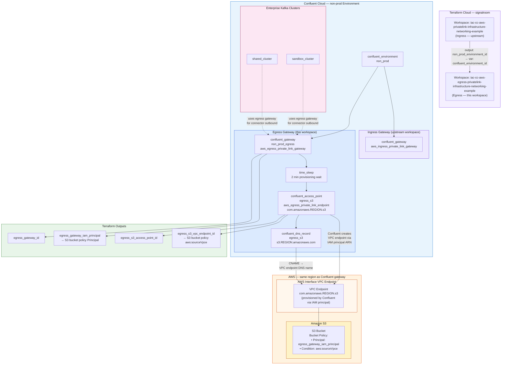

# IaC Confluent Cloud AWS Egress Private Linking, Infrastructure and Networking Example
This Terraform workspace provisions the **Confluent Cloud Egress PrivateLink** infrastructure that enables Enterprise Kafka cluster connectors (e.g., S3 Sink Connector) to reach external AWS services over private networking — without traversing the public internet.

It is a downstream workspace that depends on the environment ID output from the [ingress PrivateLink workspace](https://github.com/signalroom/iac-cc-aws-privatelink-infrastructure-networking-example).

> **Terraform Cloud Workspace:** `iac-cc-aws-egress-privatelink-infrastructure-networking-example`
> **Organization:** `signalroom`

---

## Table of Contents
<!-- toc -->
<!-- tocstop -->

1. [Overview](#overview)
2. [Architecture](#architecture)
3. [Prerequisites](#prerequisites)
4. [Workspace Dependencies](#workspace-dependencies)
5. [Resources Provisioned](#resources-provisioned)
6. [Input Variables](#input-variables)
7. [Outputs](#outputs)
8. [Usage](#usage)
9. [Post-Apply: S3 Bucket Policy](#post-apply-s3-bucket-policy)
10. [Adding More Egress Endpoints](#adding-more-egress-endpoints)

---

## **1.0 Overview**
This repo contains Terraform code to provision Confluent Cloud PrivateLink infrastructure for both ingress and egress connectivity.

---

## **2.0 Architecture**

---
