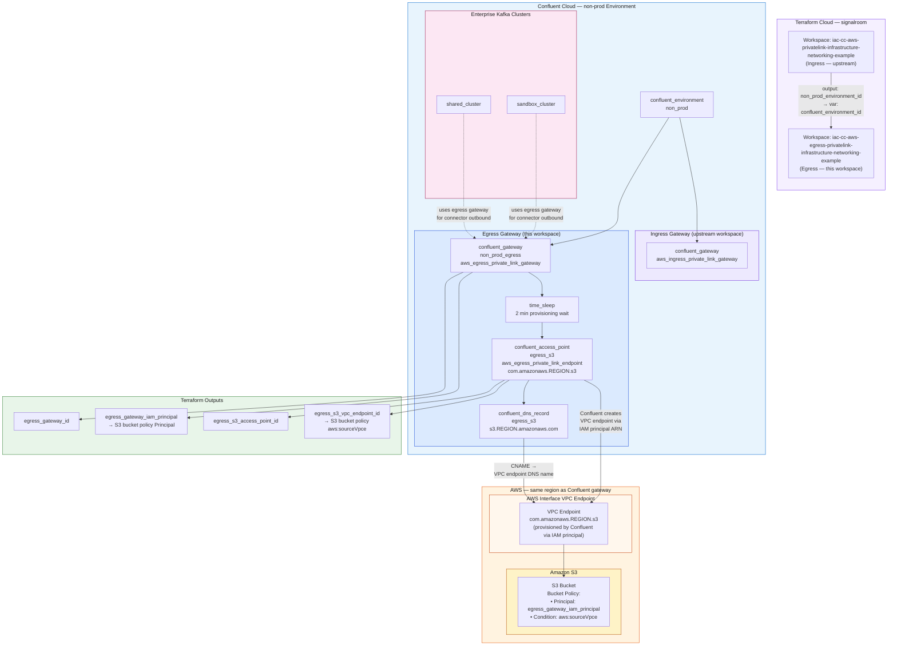

# IaC Confluent Cloud AWS Egress Private Linking, Infrastructure and Networking Example
This Terraform workspace provisions the **Confluent Cloud Egress PrivateLink** infrastructure that enables Enterprise Kafka cluster connectors (e.g., S3 Sink Connector) to reach external AWS services over private networking — without traversing the public internet.

It is a downstream workspace that depends on the environment ID output from the [ingress PrivateLink workspace](https://github.com/signalroom/iac-cc-aws-privatelink-infrastructure-networking-example).

> **Terraform Cloud Workspace:** `iac-cc-aws-egress-privatelink-infrastructure-networking-example`
> **Organization:** `signalroom`

---

## Table of Contents

1. [Overview](#overview)
2. [Architecture](#architecture)
3. [Prerequisites](#prerequisites)
4. [Workspace Dependencies](#workspace-dependencies)
5. [Resources Provisioned](#resources-provisioned)
6. [Input Variables](#input-variables)
7. [Outputs](#outputs)
8. [Usage](#usage)
9. [Post-Apply: S3 Bucket Policy](#post-apply-s3-bucket-policy)
10. [Adding More Egress Endpoints](#adding-more-egress-endpoints)

---

## Overview

AWS PrivateLink supports two directions of connectivity in Confluent Cloud:

| Direction | Gateway Type | Purpose |
|---|---|---|
| **Ingress** | `aws_ingress_private_link_gateway` | Your VPC → Confluent Cloud Kafka clusters |
| **Egress** | `aws_egress_private_link_gateway` | Confluent Cloud connectors → Your AWS services |

This workspace manages the **egress** direction. One egress gateway is allowed per AWS region per Confluent Cloud environment, and it is shared across all Enterprise clusters in that environment.

---

## Architecture



DNS resolution is handled by a `confluent_dns_record` that maps `s3.<region>.amazonaws.com` to the VPC endpoint DNS name inside Confluent Cloud's network.

---

## Prerequisites

- An existing Confluent Cloud environment (provisioned by the ingress workspace)
- Enterprise Kafka cluster(s) in the target environment and region
- Confluent Cloud API key and secret with environment-level permissions
- Terraform Cloud account with the `signalroom-iac-tfc-agents-pool` agent pool
- The S3 bucket must have a bucket policy that allows the egress gateway's IAM principal (see [Post-Apply: S3 Bucket Policy](#post-apply-s3-bucket-policy))

---

## Workspace Dependencies

This workspace consumes one output from the ingress workspace:

| Output (ingress workspace) | Variable (this workspace) | Description |
|---|---|---|
| `non_prod_environment_id` | `confluent_environment_id` | Confluent Cloud environment ID |

Set `confluent_environment_id` as a Terraform variable in TFC before the first apply.

---

## Resources Provisioned

| Resource | Type | Description |
|---|---|---|
| `confluent_gateway.non_prod_egress` | `confluent_gateway` | Egress PrivateLink gateway for the `non-prod` environment |
| `time_sleep.wait_for_egress_gateway` | `time_sleep` | 2-minute delay to allow Confluent control plane to fully provision the gateway |
| `confluent_access_point.egress_s3` | `confluent_access_point` | AWS Interface VPC Endpoint targeting `com.amazonaws.<region>.s3` |
| `confluent_dns_record.egress_s3` | `confluent_dns_record` | DNS record mapping `s3.<region>.amazonaws.com` to the VPC endpoint |

---

## Input Variables

| Variable | Type | Sensitive | Description |
|---|---|---|---|
| `confluent_api_key` | `string` | No | Confluent Cloud API Key |
| `confluent_api_secret` | `string` | **Yes** | Confluent Cloud API Secret |
| `confluent_environment_id` | `string` | No | Confluent Cloud environment ID (from ingress workspace output) |
| `aws_region` | `string` | No | AWS region for the egress gateway and access point (e.g., `us-east-1`) |

---

## Outputs

| Output | Description | Consumed By |
|---|---|---|
| `egress_gateway_id` | Confluent egress gateway ID | Future downstream workspaces |
| `egress_gateway_iam_principal` | IAM Principal ARN Confluent uses to create VPC endpoints | **S3 bucket policy allowlist** |
| `egress_s3_access_point_id` | Confluent access point ID for S3 | DNS records, connector configs |
| `egress_s3_vpc_endpoint_id` | AWS VPC endpoint ID | **S3 bucket policy `aws:sourceVpce` condition** |

---

## Usage

### 1. Set workspace variables in Terraform Cloud

In the TFC workspace `iac-cc-aws-egress-privatelink-infrastructure-networking-example`, set the following:

| Variable | Category | Sensitive |
|---|---|---|
| `confluent_api_key` | Terraform | No |
| `confluent_api_secret` | Terraform | Yes |
| `confluent_environment_id` | Terraform | No |
| `aws_region` | Terraform | No |

### 2. Run apply

```bash
terraform init
terraform plan
terraform apply
```

The apply will take approximately **4–6 minutes** — 2 minutes for the gateway sleep, plus Confluent control plane provisioning time for the access point.

### 3. Capture outputs

After a successful apply, capture the outputs:

```bash
terraform output egress_gateway_iam_principal
terraform output egress_s3_vpc_endpoint_id
```

These are required for the S3 bucket policy in the next step.

---

## Post-Apply: S3 Bucket Policy

After the workspace applies successfully, you must update your S3 bucket policy to allow inbound traffic from Confluent's egress endpoint. Use **both** conditions for strongest security posture — restricting by both the IAM principal and the VPC endpoint ID prevents confused deputy attacks.

```json
{
  "Version": "2012-10-17",
  "Statement": [
    {
      "Sid": "AllowConfluentEgressPrivateLink",
      "Effect": "Allow",
      "Principal": {
        "AWS": "<egress_gateway_iam_principal>"
      },
      "Action": [
        "s3:PutObject",
        "s3:GetObject",
        "s3:ListBucket",
        "s3:DeleteObject"
      ],
      "Resource": [
        "arn:aws:s3:::<your-bucket-name>",
        "arn:aws:s3:::<your-bucket-name>/*"
      ],
      "Condition": {
        "StringEquals": {
          "aws:sourceVpce": "<egress_s3_vpc_endpoint_id>"
        }
      }
    }
  ]
}
```

Replace `<egress_gateway_iam_principal>` and `<egress_s3_vpc_endpoint_id>` with the values from `terraform output`.

---

## Adding More Egress Endpoints

The egress gateway created here is shared across all connectors in the `non-prod` environment. To add additional targets (e.g., Snowflake, RDS, a custom PrivateLink service), add a new `confluent_access_point` and `confluent_dns_record` resource block to `main.tf` following the same pattern as `egress_s3`, referencing the same `confluent_gateway.non_prod_egress.id`.

```hcl
resource "confluent_access_point" "egress_snowflake" {
  display_name = "ccloud-egress-accesspoint-snowflake-${var.aws_region}"

  environment {
    id = data.confluent_environment.non_prod.id
  }

  gateway {
    id = confluent_gateway.non_prod_egress.id
  }

  aws_egress_private_link_endpoint {
    vpc_endpoint_service_name = "<snowflake-privatelink-service-name>"
    enable_high_availability  = false
  }

  depends_on = [time_sleep.wait_for_egress_gateway]
}
```